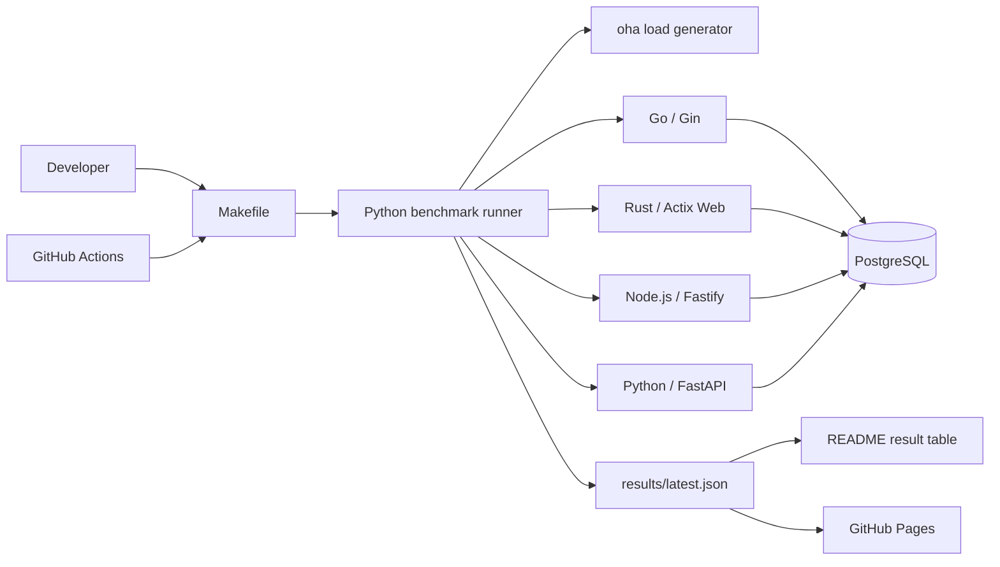

# Architecture

This document describes the planned v0.1 structure of Simple API Benchmark.

## Design goals

The architecture is intentionally small.

1. A new reader should understand the repository quickly.
2. Every backend should implement the same API contract.
3. A local benchmark should run with one command.
4. GitHub Actions should measure every backend in the same job.
5. README and GitHub Pages should read the same result file.

## Non-goals for v0.1

v0.1 does not attempt to provide:

- hundreds of framework implementations;
- a universal language ranking;
- TLS, HTTP/2, HTTP/3, WebSocket, or gRPC tests;
- ORM, write-heavy, file I/O, or multi-service tests;
- a plugin system or a custom benchmark language;
- a single composite score.

## Components



### API applications

Each backend lives in its own directory under `apps/` and is built as a Docker image. An application owns only its framework-specific implementation. It must not contain benchmark orchestration or framework-specific test data.

Every application exposes:

```text
GET /health
GET /json
GET /db/{id}
GET /cpu
```

Each implementation exposes one server process or worker. Framework-internal event loops and runtime threads are allowed, but the container remains limited to 1 CPU. The exact endpoint behavior is defined in [docs/API-CONTRACT.md](docs/API-CONTRACT.md).

#### Go / Gin

The Go implementation lives in `apps/go-gin/`. It uses Go 1.27.1, Gin 1.12.0, and pgx/v5 5.10.0. `cmd/server` owns process startup and graceful shutdown, `internal/api` owns the HTTP contract, and `internal/database` owns PostgreSQL pool configuration.

The process starts one HTTP server on internal port `8080`. Its pgx pool is capped at 10 connections and reads the shared `DATABASE_*` settings. `/db/{id}` parses the identifier before executing the parameterized query, and `/cpu` performs direct, uncached recursion for Fibonacci(30).

The production image is built with a multi-stage Dockerfile, contains only the statically linked server binary, and runs as non-root user `65532:65532`. Compose limits the container to 1 CPU and 512 MB, waits for PostgreSQL to become healthy, and publishes API port `8080` only on `127.0.0.1` for local validation. The image's health check invokes the same binary in `healthcheck` mode.

#### Rust / Actix Web

The Rust implementation lives in `apps/rust-actix/`. It uses Rust 1.98.1, Actix Web 4.15.0, and SQLx 0.9.0. `src/main.rs` owns process startup and fixes the Actix worker count at one, `src/api.rs` owns the HTTP contract, `src/database.rs` owns PostgreSQL connection configuration, and `src/item.rs` owns the parameterized item lookup abstraction.

The process listens on internal port `8080`, reads the shared `DATABASE_*` settings, and caps the SQLx pool at 10 connections. `/db/{id}` validates the identifier before binding it to the query, while `/cpu` performs direct, uncached recursion for Fibonacci(30) on every request.

The production image is a release multi-stage build and runs as numeric non-root user `65532:65532`. Compose limits the container to 1 CPU and 512 MB, waits for PostgreSQL to become healthy, and publishes API port `8080` only on `127.0.0.1`. The image health check invokes the same binary in `healthcheck` mode.

### PostgreSQL

One PostgreSQL container is shared by all implementations. It runs as the `postgres` service on the project-scoped `benchmark` network without a published host port. API services connect on internal port `5432` using the common `DATABASE_HOST`, `DATABASE_PORT`, `DATABASE_NAME`, `DATABASE_USER`, and `DATABASE_PASSWORD` settings defined in the Compose extension field.

The environment uses `postgres:18.6-bookworm` pinned to index digest `sha256:1c59e2c3c818eaa0f0628f695b36e7c9e362d6b219b36a54a32df645cbd7e1af`. PostgreSQL 18 stores its versioned data directory below `/var/lib/postgresql`, so that parent directory is mounted as `tmpfs`. No benchmark database state survives environment recreation.

The schema and fixture data are created from `database/init.sql`. The DB test uses the same parameterized query, the exact row `(42, 'Item 42', 4200)`, and a maximum pool size of 10 connections for every backend. `make db-up` waits for the Compose health check and validates the fixture, while `make db-reset` removes the current environment before recreating it.

### Contract tests

`benchmark/contract_test.py` checks response status, content type, and JSON values before any performance measurement. A backend that fails the contract is not benchmarked.

### Benchmark runner

`benchmark/run.py` is the orchestration entry point. It will:

1. read `benchmark/config.json`;
2. start one backend at a time;
3. wait for `GET /health`;
4. run a short warm-up;
5. run each test exactly three times with `oha`;
6. collect throughput, response time, and peak container memory;
7. reject a test result if any measured run has errors or timeouts;
8. write `results/latest.json`.

The runner is Python because it is easy to read and is not part of the measured request path.

### Results page

The v0.1 results page is a static site under `site/`. It reads `results/latest.json` and displays a small table and bar charts. It does not need a frontend framework or server-side runtime.

## Planned repository layout

```text
simple-api-benchmark/
├── .github/workflows/
│   ├── ci.yml
│   └── benchmark.yml
├── apps/
│   ├── go-gin/
│   ├── rust-actix/
│   ├── node-fastify/
│   └── python-fastapi/
├── benchmark/
│   ├── config.json
│   ├── contract_test.py
│   ├── generate_readme.py
│   └── run.py
├── database/
│   └── init.sql
├── docs/
│   ├── API-CONTRACT.md
│   └── METHODOLOGY.md
├── results/
│   ├── latest.json
│   └── history/
├── site/
│   ├── app.js
│   ├── index.html
│   └── style.css
├── docker-compose.yml
├── Makefile
└── README.md
```

Directories are added only when the related implementation issue is completed.

## Local benchmark flow

```text
make benchmark
  ├─ build Docker images
  ├─ start PostgreSQL
  ├─ verify all API contracts
  ├─ benchmark JSON
  ├─ benchmark PostgreSQL
  ├─ benchmark CPU
  ├─ collect memory values
  ├─ write results/latest.json
  └─ stop containers
```

Cleanup must run even when a build, contract test, or benchmark fails.

## GitHub Actions flow

### Pull requests

`ci.yml` will build changed applications, run contract tests, and execute a short smoke benchmark. Pull requests do not update published results.

### Scheduled and manual benchmarks

`benchmark.yml` will run weekly and through `workflow_dispatch`. All four backends are measured sequentially in one GitHub Actions job so that they use the same runner.

A successful run updates the result artifact used by README and GitHub Pages. A failed or incomplete run must not replace the latest verified result.

## Resource limits

The initial v0.1 profile is deliberately easy to explain:

```text
API container CPU:          1 CPU
API container memory:       512 MB
API server processes:       1
PostgreSQL pool maximum:    10 connections
Benchmark duration:         30 seconds
Concurrent connections:     50
Runs per test:               3
Displayed value:             middle result
```

The values may be adjusted before the first published benchmark if GitHub-hosted runner measurements show that the load generator becomes the bottleneck. Any change must be documented before publishing results.

## Security boundary

Framework implementations are executable code. Pull request workflows therefore use read-only repository access and do not receive deployment credentials. Publishing is performed only from trusted code on the default branch.
