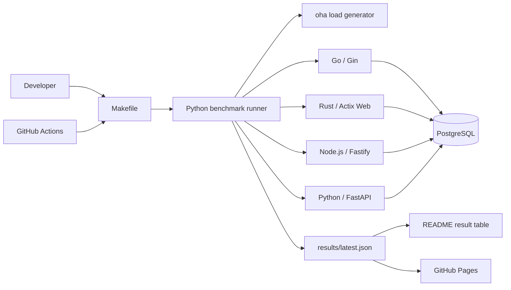

# Architecture

This document describes the planned v0.1 structure of Simple API Benchmark.

## Design goals

The architecture is intentionally small.

1. A new reader should understand the repository quickly.
2. Every backend should implement the same API contract.
3. A local benchmark should run with one command.
4. GitHub Actions should measure every backend in the same job.
5. README and GitHub Pages should read the same result file.

## Non-goals for v0.1

v0.1 does not attempt to provide:

- hundreds of framework implementations;
- a universal language ranking;
- TLS, HTTP/2, HTTP/3, WebSocket, or gRPC tests;
- ORM, write-heavy, file I/O, or multi-service tests;
- a plugin system or a custom benchmark language;
- a single composite score.

## Components



### API applications

Each backend lives in its own directory under `apps/` and is built as a Docker image. An application owns only its framework-specific implementation. It must not contain benchmark orchestration or framework-specific test data.

Every application exposes:

```text
GET /health
GET /json
GET /db/{id}
GET /cpu
```

Each implementation exposes one server process or worker. Framework-internal event loops and runtime threads are allowed, but the container remains limited to 1 CPU. The exact endpoint behavior is defined in [docs/API-CONTRACT.md](docs/API-CONTRACT.md).

#### Go / Gin

The Go implementation lives in `apps/go-gin/`. It uses Go 1.27.1, Gin 1.12.0, and pgx/v5 5.10.0. `cmd/server` owns process startup and graceful shutdown, `internal/api` owns the HTTP contract, and `internal/database` owns PostgreSQL pool configuration.

The process starts one HTTP server on internal port `8080`. Its pgx pool is capped at 10 connections and reads the shared `DATABASE_*` settings. `/db/{id}` parses the identifier before executing the parameterized query, and `/cpu` performs direct, uncached recursion for Fibonacci(30).

The production image is built with a multi-stage Dockerfile, contains only the statically linked server binary, and runs as non-root user `65532:65532`. Compose limits the container to 1 CPU and 512 MB, waits for PostgreSQL to become healthy, and publishes API port `8080` only on `127.0.0.1` for local validation. The image's health check invokes the same binary in `healthcheck` mode.

#### Rust / Actix Web

The Rust implementation lives in `apps/rust-actix/` and pins Rust 1.98.1, Actix Web 4.15.0, SQLx 0.9.0, Serde 1.0.228, and serde_json 1.0.145. `Cargo.lock` fixes the transitive dependency graph. One Actix worker serves port `8080`, uses native Serde response values, and performs direct recursive Fibonacci(30) for every CPU request. The SQLx pool connects before HTTP startup and allows at most 10 PostgreSQL connections.

The production Dockerfile uses the published `rust:1.98.0-bookworm` builder pinned by digest and explicitly installs compiler 1.98.1, which fixes a compiler miscompilation. It builds with `cargo +1.98.1 build --release --locked`. The digest-pinned Debian Bookworm slim runtime contains the release binary, not Cargo or the source tree, and runs as `65532:65532`. Compose waits for healthy PostgreSQL, drops capabilities, disallows privilege escalation, applies 1 CPU / 512 MB limits, publishes only `127.0.0.1:8080`, and disables restarts.

`src/api.rs` owns the native response DTOs, ID parsing, and direct recursive CPU calculation. `src/item.rs` binds signed BIGINT IDs to the shared query using SQLx. Invalid IDs return 400 before a store call; absent rows return 404, and query errors produce only `{"error":"internal server error"}`. Configuration diagnostics omit sensitive values. `src/healthcheck.rs` checks the readiness response with bounded connection/read/write timeouts and rejects additional JSON fields.

Rust tests use in-memory configuration lookups rather than mutating process-global environment variables. Docker acceptance verifies real row updates, exact BIGINT values, SQL errors, the direct non-root server process, startup failure, normal SIGTERM exit, and zero remaining application DB connections after shutdown.

#### Node.js / Fastify

The Node implementation lives in `apps/node-fastify/`. Node.js 24.20.0 LTS, Fastify 5.12.3, and pg 8.23.0 are explicitly pinned, including the transitive dependency lock. `src/app.js` owns routes and native JSON responses, `src/database.js` creates the PostgreSQL pool from all five required `DATABASE_*` settings, and `src/server.js` owns startup and shutdown. `src/healthcheck.js` verifies the readiness response with a two-second timeout.

The process checks PostgreSQL with `SELECT 1` before listening on `0.0.0.0:8080` inside the container. The pool uses at most 10 connections and a five-second connection timeout. Decimal IDs are validated against PostgreSQL's signed BIGINT range before a bound-parameter query. pg returns BIGINT values as strings; safe values become JavaScript numbers, while larger values use the native `JSON.rawJSON` numeric primitive to preserve exact numeric JSON through Fastify's normal serialization path. DB failures return only `{"error":"internal server error"}`. Each `/cpu` request invokes direct recursive Fibonacci(30), with no cached or precomputed result.

The multi-stage Dockerfile installs runtime dependencies with `npm ci --omit=dev --ignore-scripts`. Both stages use `node:24.20.0-bookworm-slim` pinned to index digest `sha256:ba849c60be29959425b8734d57b8b4b7d56f98edd9504c9af091d5281095a71e`. The final image excludes tests and dependency-install caches, runs as user `node`, and starts `node src/server.js` directly. Compose applies production mode, PostgreSQL health ordering, 1 CPU / 512 MB, capability removal, no privilege escalation, and loopback-only host port publication. SIGINT/SIGTERM close the server and pool with a five-second shutdown deadline.

#### Python / FastAPI

The Python implementation lives in `apps/python-fastapi/`. Python 3.14.7, FastAPI 0.141.1, Uvicorn 0.52.4, and asyncpg 0.31.0 are explicitly pinned. `benchmark_api/app.py` owns the routes, ordinary Python response values, and FastAPI lifespan. `benchmark_api/database.py` validates all five shared `DATABASE_*` settings and owns the asyncpg pool. `benchmark_api/healthcheck.py` checks the HTTP status, JSON content type, and exact readiness body with a two-second timeout.

The lifespan creates a pool with `min_size=1` and `max_size=10`, executes `SELECT 1`, and only then allows Uvicorn to accept requests. Connection and command timeouts are five seconds. IDs must be ASCII signed decimal integers in PostgreSQL's BIGINT range; invalid IDs return 400 before any pool query. Valid IDs are passed to `SELECT id, name, price FROM items WHERE id = $1` as a bound integer. Missing rows return 404, and DB failures expose only `{"error":"internal server error"}`. Python integers preserve BIGINT values through normal FastAPI serialization. The async CPU route directly computes recursive Fibonacci(30) for each request on the event loop, without an executor, memoization, or precomputed data.

Uvicorn is the direct container process, with `--workers 1 --loop asyncio --http h11`, no access log, and a five-second graceful HTTP shutdown timeout. The lifespan closes the pool with a five-second bound and terminates remaining connections only if graceful pool closure fails or is cancelled. The production image installs only the SHA256-verified runtime lock and excludes tests and development tools. Both Docker stages use `python:3.14.7-slim-bookworm` pinned to index digest `sha256:9ab8d9c8514b44f90cf0029dd42fdd7e9e211e639c8b995304cc04568dee900f`. Compose uses non-root user `10001:10001`, 1 CPU / 512 MB, healthy PostgreSQL ordering, dropped capabilities, no privilege escalation, loopback-only port `8080`, and no restarts.

### PostgreSQL

One PostgreSQL container is shared by all implementations. It runs as the `postgres` service on the project-scoped `benchmark` network without a published host port. API services connect on internal port `5432` using the common `DATABASE_HOST`, `DATABASE_PORT`, `DATABASE_NAME`, `DATABASE_USER`, and `DATABASE_PASSWORD` settings defined in the Compose extension field.

The environment uses `postgres:18.6-bookworm` pinned to index digest `sha256:1c59e2c3c818eaa0f0628f695b36e7c9e362d6b219b36a54a32df645cbd7e1af`. PostgreSQL 18 stores its versioned data directory below `/var/lib/postgresql`, so that parent directory is mounted as `tmpfs`. No benchmark database state survives environment recreation.

The schema and fixture data are created from `database/init.sql`. The DB test uses the same parameterized query, the exact row `(42, 'Item 42', 4200)`, and a maximum pool size of 10 connections for every backend. `make db-up` waits for the Compose health check and validates the fixture, while `make db-reset` removes the current environment before recreating it.

### Contract tests

`benchmark/contract_test.py` reads the HTTP/JSON examples in `docs/API-CONTRACT.md`
and applies the same assertions to any base URL. It verifies HTTP/1.1, status,
JSON content type, exact object structure, values, and native JSON types in two
rounds. Its standard-library transport has socket and whole-response deadlines
and a response size limit. Failed assertions raise `ContractFailure`; the CLI
exits non-zero so a later benchmark caller must stop before measuring.

`benchmark/contract_runner.py`, exposed by `make test-contract`, builds and starts
one implementation at a time on `127.0.0.1:8080`. It waits for Compose readiness
and tears down its unique project after every implementation, including on failure
or handled interruption. Recreating PostgreSQL between implementations isolates the
tmpfs fixture. This is correctness orchestration only, not the benchmark runner.
See [Contributing](CONTRIBUTING.md#shared-contract-checks) for one/all commands,
timeouts, cleanup limits, and focused tests.

### Benchmark runner

`benchmark/run.py` is the orchestration entry point. It will:

1. read `benchmark/config.json`;
2. start one backend at a time;
3. wait for `GET /health`;
4. run a short warm-up;
5. run each test exactly three times with `oha`;
6. collect throughput, response time, and peak container memory;
7. reject a test result if any measured run has errors or timeouts;
8. write `results/latest.json`.

The runner is Python because it is easy to read and is not part of the measured request path.

### Results page

The v0.1 results page is a static site under `site/`. It reads `results/latest.json` and displays a small table and bar charts. It does not need a frontend framework or server-side runtime.

## Planned repository layout

```text
simple-api-benchmark/
├── .github/workflows/
│   ├── ci.yml
│   └── benchmark.yml
├── apps/
│   ├── go-gin/
│   ├── rust-actix/
│   ├── node-fastify/
│   └── python-fastapi/
├── benchmark/
│   ├── config.json
│   ├── contract_test.py
│   ├── contract_runner.py
│   ├── generate_readme.py
│   └── run.py
├── database/
│   └── init.sql
├── docs/
│   ├── API-CONTRACT.md
│   └── METHODOLOGY.md
├── results/
│   ├── latest.json
│   └── history/
├── site/
│   ├── app.js
│   ├── index.html
│   └── style.css
├── docker-compose.yml
├── Makefile
└── README.md
```

Directories are added only when the related implementation issue is completed.

## Local benchmark flow

```text
make benchmark
  ├─ build Docker images
  ├─ start PostgreSQL
  ├─ verify all API contracts
  ├─ benchmark JSON
  ├─ benchmark PostgreSQL
  ├─ benchmark CPU
  ├─ collect memory values
  ├─ write results/latest.json
  └─ stop containers
```

Cleanup must run even when a build, contract test, or benchmark fails.

## GitHub Actions flow

### Pull requests

`ci.yml` will build changed applications, run contract tests, and execute a short smoke benchmark. Pull requests do not update published results.

### Scheduled and manual benchmarks

`benchmark.yml` will run weekly and through `workflow_dispatch`. All four backends are measured sequentially in one GitHub Actions job so that they use the same runner.

A successful run updates the result artifact used by README and GitHub Pages. A failed or incomplete run must not replace the latest verified result.

## Resource limits

The initial v0.1 profile is deliberately easy to explain:

```text
API container CPU:          1 CPU
API container memory:       512 MB
API server processes:       1
PostgreSQL pool maximum:    10 connections
Benchmark duration:         30 seconds
Concurrent connections:     50
Runs per test:               3
Displayed value:             middle result
```

The values may be adjusted before the first published benchmark if GitHub-hosted runner measurements show that the load generator becomes the bottleneck. Any change must be documented before publishing results.

## Security boundary

Framework implementations are executable code. Pull request workflows therefore use read-only repository access and do not receive deployment credentials. Publishing is performed only from trusted code on the default branch.
