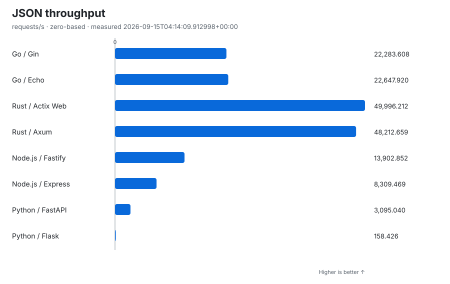
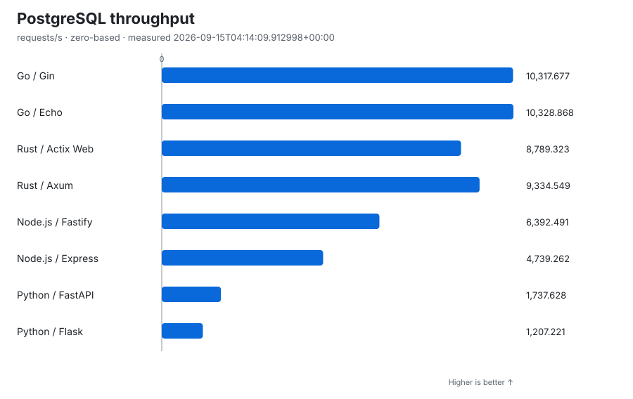
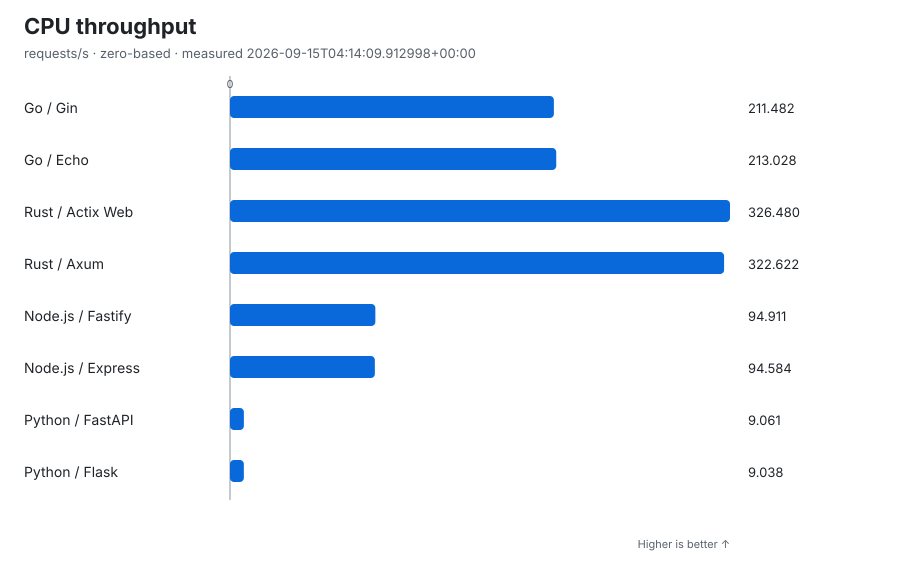

# Simple API Benchmark

[日本語](README.ja.md) · [Results site](https://tappe9.github.io/simple-api-benchmark/)

**Go vs Rust vs Node.js vs Python — same API, same limits, simple results.**

Simple API Benchmark contains nine API implementations with the same endpoints, Docker resource limits, and validation rules. The goal is not to declare a universal winner. The goal is to make a small, repeatable comparison that anyone can understand.

> **Project status:** v0.1.0 is released as the original four-stack snapshot. Current `main` includes nine CI-covered implementations. The active `eight-stack-v1` cohort has verified published results and a Pages dashboard with history navigation. Java / Spring Boot is registered for validation but is not part of the official cohort or published results.

The first complete eight-stack official result was published on September 15, 2026
under [Issue #50 / PR #58](https://github.com/tappe9/simple-api-benchmark/pull/58).
The Results section identifies the latest **verified publication**; implementation,
cohort activation and result publication are separate milestones. Historical
`four-stack-v1` reports and the v0.1.0 release remain unchanged. See the
[cohort rollout guide](docs/IMPLEMENTATIONS.md#eight-stack-rollout-boundary-50)
and [Issue #50](https://github.com/tappe9/simple-api-benchmark/issues/50) for rollout verification.

## Results

<!-- benchmark-results:start -->

Measured (UTC): `2026-09-15T04:14:09.912998+00:00`
Source: `c8e033ea176366644f5bed5ded12cab79e6fcbeb` · [Actions run](https://github.com/tappe9/simple-api-benchmark/actions/runs/34925168324)
Cohort: `eight-stack-v1` · Definition: `simple-api-v1` · API readiness: `external-readiness`

1 CPU · 512 MiB · 1 worker · DB pool 10 · HTTP/1.1 · 50 connections · 5 s warm-up · 3 × 30 s per endpoint. Middle-throughput whole run selected.

### Throughput at a glance







<details>
<summary>Full selected-run values</summary>

| Backend | Test | Requests/s ↑ | Mean response ms ↓ | Observed peak MiB ↓ |
| --- | --- | ---: | ---: | ---: |
| Go / Gin | JSON | 22,283.608 | 2.241 | 13.050 |
| Go / Gin | PostgreSQL | 10,317.677 | 4.842 | 16.210 |
| Go / Gin | CPU | 211.482 | 235.349 | 14.860 |
| Go / Echo | JSON | 22,647.920 | 2.205 | 12.990 |
| Go / Echo | PostgreSQL | 10,328.868 | 4.836 | 16.480 |
| Go / Echo | CPU | 213.028 | 233.817 | 13.790 |
| Rust / Actix Web | JSON | 49,996.212 | 0.998 | 2.969 |
| Rust / Actix Web | PostgreSQL | 8,789.323 | 5.684 | 4.602 |
| Rust / Actix Web | CPU | 326.480 | 152.744 | 4.758 |
| Rust / Axum | JSON | 48,212.659 | 1.035 | 3.266 |
| Rust / Axum | PostgreSQL | 9,334.549 | 5.352 | 4.617 |
| Rust / Axum | CPU | 322.622 | 154.554 | 4.773 |
| Node.js / Fastify | JSON | 13,902.852 | 3.593 | 33.770 |
| Node.js / Fastify | PostgreSQL | 6,392.491 | 7.816 | 44.850 |
| Node.js / Fastify | CPU | 94.911 | 522.313 | 44.870 |
| Node.js / Express | JSON | 8,309.469 | 6.014 | 45.190 |
| Node.js / Express | PostgreSQL | 4,739.262 | 10.543 | 48.170 |
| Node.js / Express | CPU | 94.584 | 523.981 | 48.080 |
| Python / FastAPI | JSON | 3,095.040 | 16.146 | 41.010 |
| Python / FastAPI | PostgreSQL | 1,737.628 | 28.760 | 42.250 |
| Python / FastAPI | CPU | 9.061 | 5,099.296 | 42.840 |
| Python / Flask | JSON | 158.426 | 315.452 | 37.850 |
| Python / Flask | PostgreSQL | 1,207.221 | 41.387 | 37.890 |
| Python / Flask | CPU | 9.038 | 5,109.111 | 37.870 |

</details>

↑ Higher is better; ↓ lower is better. Every chart starts at zero and compares only throughput within one endpoint. Memory samples cover only the API container, not PostgreSQL, and can miss brief peaks. These are complete-stack reference results on shared GitHub-hosted hardware, not universal language rankings.

[Result JSON](results/latest.json) · [History](results/history/) · [Detailed results site](https://tappe9.github.io/simple-api-benchmark/) · [Methodology](docs/METHODOLOGY.md) · [Versions and conditions](results/latest.json)

<!-- benchmark-results:end -->

## What is compared?

| Language | Framework |
|---|---|
| Go | Gin |
| Go | Echo |
| Rust | Actix Web |
| Rust | Axum |
| Node.js | Fastify |
| Node.js | Express |
| Python | FastAPI |
| Python | Flask |

Each implementation provides the same three benchmark endpoints:

| Test | Endpoint | Simple explanation |
|---|---|---|
| JSON | `GET /json` | Return a small JSON response |
| PostgreSQL | `GET /db/42` | Read one row and return it as JSON |
| CPU | `GET /cpu` | Calculate Fibonacci(30) and return the result |

A separate `GET /health` endpoint is used only to check readiness.

The active `eight-stack-v1` cohort includes all eight implementations above. Historical `four-stack-v1` reports contain only Go / Gin, Rust / Actix Web, Node.js / Fastify, and Python / FastAPI; the other frameworks are never inserted into historical results or displayed as zero-valued measurements.

## Same conditions

Every implementation uses:

- the same API contract;
- the same input and expected output;
- the same CPU and memory limits;
- one server process or worker;
- the same PostgreSQL data, SQL, and pool limit;
- the same load settings;
- three benchmark runs, with the middle result shown.

Contract tests run before measurements. A result with request errors or timeouts is not published as a valid result.

## Local PostgreSQL environment

Docker Compose v2 and Make are required. The shared database uses the official `postgres:18.6-bookworm` image pinned by digest. It runs as the `postgres` service on the project-scoped `benchmark` network and does not publish a host port.

| Setting | Value |
|---|---|
| Service / host | `postgres` |
| Internal port | `5432` |
| Database | `benchmark` |
| User | `benchmark` |
| Password | `benchmark` |

These are intentionally simple local-only defaults, not production credentials. API services use the common `DATABASE_HOST`, `DATABASE_PORT`, `DATABASE_NAME`, `DATABASE_USER`, and `DATABASE_PASSWORD` settings from `docker-compose.yml`.

```bash
make db-up      # start PostgreSQL, wait for health, and validate the fixture
make db-check   # validate the exact fixture in the running database
make db-reset   # discard all current DB state and recreate the fixture
make test-db    # run the complete startup, reset, and cleanup acceptance check
make down       # remove containers and the project network
```

PostgreSQL data lives on `tmpfs`. It is never reused across a recreated environment, and `database/init.sql` always creates the same `items` table and row `42 | Item 42 | 4200`.

## Go / Gin implementation

The Go / Gin implementation lives in `apps/go-gin/` and currently uses Go 1.27.1, Gin 1.12.0, and pgx/v5 5.10.0. It runs one server process with a PostgreSQL pool capped at 10 connections. Docker Compose limits the API container to 1 CPU and 512 MB, runs it as non-root user `65532:65532`, and publishes port `8080` only on the loopback interface.

```bash
docker compose up --detach --build --wait go-gin
curl http://127.0.0.1:8080/health
curl http://127.0.0.1:8080/json
curl http://127.0.0.1:8080/db/42
curl http://127.0.0.1:8080/cpu
make down
```

Run the complete Go formatting, unit-test, vet, container, API-contract, resource-limit, and cleanup checks with:

```bash
make test-go-gin
```

## Go / Echo implementation

The Go / Echo implementation lives in `apps/go-echo/` and pins Go 1.27.1, Echo v5.3.1, and pgx/v5 5.10.0 so it stays directly comparable with the Gin baseline without silently upgrading the Go runtime or PostgreSQL driver. It uses the same SQL and fixture, connects before serving HTTP, and caps the PostgreSQL pool at 10 connections.

One `net/http` server process serves the Echo router. The implementation adds no unrelated middleware, response cache, or CPU precomputation; `/cpu` performs direct recursive Fibonacci(30) for every request. The production image contains only the statically built binary, runs as non-root `65532:65532`, and inherits the shared 1 CPU / 512 MB isolation envelope, capability drop, no-new-privileges policy, loopback-only port publication, and restart policy from Compose.

```bash
docker compose up --detach --build --wait go-echo
curl http://127.0.0.1:8080/health
curl http://127.0.0.1:8080/json
curl http://127.0.0.1:8080/db/42
curl http://127.0.0.1:8080/cpu
make down
make test-go-echo
```

`make test-go-echo` runs formatting, unit tests, vet, production image and real PostgreSQL/API acceptance checks, BIGINT boundaries, startup failure, graceful SIGTERM shutdown, resource/process isolation, and cleanup. The shared contract suite runs against Echo unchanged. A future Gin-versus-Echo result is still a complete-stack comparison of framework/router behavior under this repository's fixed conditions, not a universal ranking of Go frameworks.

## Rust / Actix Web implementation

The Rust implementation lives in `apps/rust-actix/` and pins Rust 1.98.1, Actix Web 4.15.0, SQLx 0.9.0, Serde 1.0.228, and serde_json 1.0.145. `Cargo.lock` fixes the transitive dependency graph. One Actix worker serves port `8080`, uses native Serde response values, and performs direct recursive Fibonacci(30) for every CPU request. The SQLx pool connects before HTTP startup and allows at most 10 PostgreSQL connections.

The production Dockerfile uses the published `rust:1.98.0-bookworm` builder pinned by digest and explicitly installs compiler 1.98.1, which fixes a compiler miscompilation. It builds with `cargo +1.98.1 build --release --locked`. The digest-pinned Debian Bookworm slim runtime contains the release binary, not Cargo or the source tree, and runs as `65532:65532`. Compose waits for healthy PostgreSQL, drops capabilities, disallows privilege escalation, applies 1 CPU / 512 MB limits, publishes only `127.0.0.1:8080`, and disables restarts.

```bash
docker compose up --detach --build --wait rust-actix
curl http://127.0.0.1:8080/health
curl http://127.0.0.1:8080/json
curl http://127.0.0.1:8080/db/42
curl http://127.0.0.1:8080/cpu
make down
make test-rust-actix
```

The acceptance target requires Rustup, Python 3, Docker Compose v2, and Make. It runs formatting, locked Rust tests, Clippy with warnings denied, real DB and API checks, BIGINT boundaries, startup failure, SIGTERM shutdown, and container/network cleanup. Run API services sequentially because they share host port `8080`.

## Rust / Axum implementation

`apps/rust-axum/` adds Axum 0.8.9 and Tokio 1.53.1 without changing the Actix implementation. Rust 1.98.1, SQLx 0.9.0, Serde 1.0.228, serde_json 1.0.145, and the digest-pinned builder/runtime bases match that baseline. The committed lockfile fixes transitive dependencies.

One direct server process uses an explicit Tokio `current_thread` executor. Native Serde responses, the shared parameterized SQL and pool maximum of 10, and per-request direct recursive Fibonacci(30) are preserved. There is no CPU offload, response cache, or additional async worker. SIGINT/SIGTERM drain accepted requests before closing the pool. The non-root release image inherits the shared 1 CPU / 512 MiB isolation envelope.

```bash
make test-rust-axum                       # Rust gates and real PostgreSQL/container acceptance
make test-contract CONTRACT_IMPL=rust-axum # unchanged shared contract
make axum-diagnostic                      # clean committed source; never publishes results
```

Run these commands sequentially with port 8080 free. The Axum-only diagnostic uses the existing pinned load generator and external readiness, records provenance, versions and raw evidence under `.cache/axum-diagnostic/`, and fails on request errors or cleanup failure. Its short profile is not an official performance result. It is a required step in Axum's normal CI job; no temporary development workflow is needed. See [Axum implementation and diagnostic](docs/AXUM.md) for runtime details, test coverage, and output guarantees.

## Node.js / Fastify implementation

The Node implementation lives in `apps/node-fastify/` and uses Node.js 24.20.0 LTS, Fastify 5.12.3, and pg 8.23.0. Direct dependencies and `package-lock.json` are pinned; the official `node:24.20.0-bookworm-slim` image is also pinned by digest. The LTS runtime and stable Fastify 5 release line keep this baseline reproducible and maintainable.

It starts one Node process directly in production mode, waits for a PostgreSQL readiness query, and uses a pool capped at 10 connections. The container runs as non-root user `node`, drops Linux capabilities, and uses the shared 1 CPU / 512 MB limits. Only `127.0.0.1:8080` is published. `/json` uses native objects and `/cpu` calculates Fibonacci(30) by direct recursion on every request. Shutdown closes the HTTP server and pool.

Start only one API at a time because implementations share the local port:

```bash
docker compose up --detach --build --wait node-fastify
curl http://127.0.0.1:8080/health
curl http://127.0.0.1:8080/json
curl http://127.0.0.1:8080/db/42
curl http://127.0.0.1:8080/cpu
make down
make test-node-fastify
```

`make test-node-fastify` requires Node.js 24.20.0, npm, Python 3, Docker Compose v2, and Make. It runs focused tests, syntax validation, production image build, exact API responses against PostgreSQL, BIGINT boundaries, sanitized DB errors, resource/process checks, graceful shutdown, and container/network cleanup.

## Python / FastAPI implementation

The Python implementation lives in `apps/python-fastapi/` and uses Python 3.14.7, FastAPI 0.141.1, Uvicorn 0.52.4, and asyncpg 0.31.0. Runtime and development dependencies have exact, SHA256-verified lock files. Both Docker stages use the official `python:3.14.7-slim-bookworm` image pinned by index digest.

Uvicorn runs directly with one worker, the standard asyncio event loop, and the h11 HTTP/1.1 implementation. Startup checks PostgreSQL before accepting HTTP requests; the asyncpg pool has at most 10 connections. Responses are serialized from ordinary Python values, including exact signed BIGINT IDs. Every `/cpu` request computes Fibonacci(30) by direct recursion, without caching or precomputation. Lifespan shutdown closes the pool.

The production container runs as non-root user `10001:10001`, excludes tests and development dependencies, drops Linux capabilities, and uses 1 CPU / 512 MB. Compose waits for PostgreSQL health, publishes only `127.0.0.1:8080`, probes `/health`, and does not restart the service.

```bash
docker compose up --detach --build --wait python-fastapi
curl http://127.0.0.1:8080/health
curl http://127.0.0.1:8080/json
curl http://127.0.0.1:8080/db/42
curl http://127.0.0.1:8080/cpu
make down
make test-python-fastapi PYTHON=python3.14
```

The complete acceptance target requires Python 3.14.7 on a POSIX host, Docker Compose v2, and Make. It installs the hash-locked development dependencies in a temporary virtual environment, runs Ruff and focused pytest tests, and verifies the real Docker service, DB errors and updates, resources, one worker, startup failure, SIGTERM shutdown, and container/network cleanup. See [Contributing](CONTRIBUTING.md) for focused tests without Docker.

## Java / Spring Boot implementation

`apps/java-spring-boot/` uses Temurin 25.0.4.1+1, Spring Boot 4.1.1,
Spring MVC/Tomcat, JDBC/HikariCP, and checksum-verified Gradle 9.7.1.
It follows the same API, single-process, 1 CPU / 512 MiB and ten-connection
limits. It is the **ninth registered implementation**, not an additional official
result. `eight-stack-v1` and all published measurements remain unchanged.

```bash
make test-java-spring-boot
make test-contract CONTRACT_IMPL=java-spring-boot
```

The acceptance target needs the exact JDK, Python 3.10+, Make and Docker Compose
v2 on a POSIX host. The container-only contract target does not need a host JDK.
See the [Java implementation guide](docs/JAVA-SPRING-BOOT.md) for build integrity,
startup/shutdown behavior, supported build paths and the unmeasured boundary.

All nine API implementations and the shared contract suite are available:

```bash
make test-contract                       # all nine registered APIs, one at a time
make test-contract CONTRACT_IMPL=go-echo # one API with the same contract
```

The suite checks exact statuses, JSON content and types, documented errors, and
repeated responses, and cleans up its isolated environments even after failure.
See [the shared contract guide](CONTRIBUTING.md#shared-contract-checks) for
requirements, standalone base-URL checks, and cleanup limits. The local benchmark runner
is available, and pull requests run the same checks plus a non-publishing smoke benchmark.
Official benchmarks are [explicitly requested on trusted main](docs/AUTOMATION.md#when-to-request-an-official-benchmark)
after performance-relevant changes, or for a justified reproducibility investigation.
There is no weekly or automatic change-triggered measurement. Updating upstream
packages alone does not update this repository's pinned versions. Each dispatch
still includes the existing audited automatic publication and Pages deployment;
it is not a measurement-only operation. Publication redesign and main protection
remain separate decisions.
The active official cohort is `eight-stack-v1`, with its first verified publication
completed under Issue #50. Each subsequent result update still requires a new,
complete, verified official run; historical four-stack reports are not rewritten.

Official publication calls the shared Pages deployment directly after a successful audited push. See [deployment authorization and recovery](docs/AUTOMATION.md#github-pages); presentation recovery does not require another benchmark. Product releases are
separate [maintainer-initiated operations](docs/RELEASING.md), never a Pages side effect.

## Run the local benchmark

With a clean committed source tree, Python 3.10+, curl and local Docker Compose v2:

```bash
make benchmark
```

It verifies/installs checksum-pinned oha 1.16.0, builds and starts one API at a time,
runs the shared contract, performs the fixed warm-up and three measured runs per
endpoint, and atomically writes `results/latest.json` only after all results and
cleanup succeed. Existing results survive any partial failure. The generated file
is a local result, not an official publication.

Use `make test-benchmark` for focused tests or `make benchmark-smoke` for a short
diagnostic that never replaces `latest.json`. See [the benchmark guide](docs/BENCHMARK.md)
for requirements, exact units, result schema, deadlines and memory-sampling limitations.

## Documentation

- [Results site](https://tappe9.github.io/simple-api-benchmark/)
- [Architecture](ARCHITECTURE.md)
- [Axum implementation and diagnostic](docs/AXUM.md)
- [API contract](docs/API-CONTRACT.md)
- [Benchmark methodology](docs/METHODOLOGY.md)
- [Running benchmarks and result format](docs/BENCHMARK.md)
- [Roadmap](ROADMAP.md)
- [Contributing](CONTRIBUTING.md)
- [Security](SECURITY.md)

## Important limitation

This project compares complete API stacks, not programming languages or frameworks in isolation. Results include the framework, runtime, HTTP server, JSON library, PostgreSQL driver, and container configuration. A result such as “Rust / Actix Web was fastest in this run” does not mean “Rust is always fastest,” and a future Gin-versus-Echo difference would not establish a universal ordering between those Go frameworks.

## License

[MIT](LICENSE)
