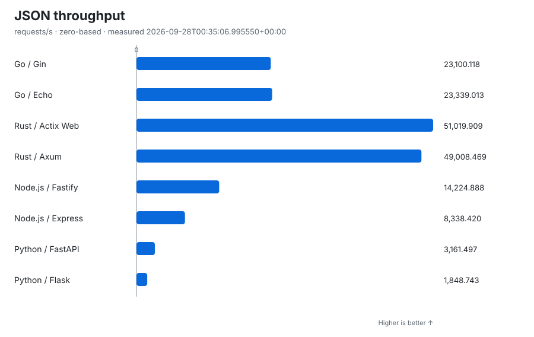
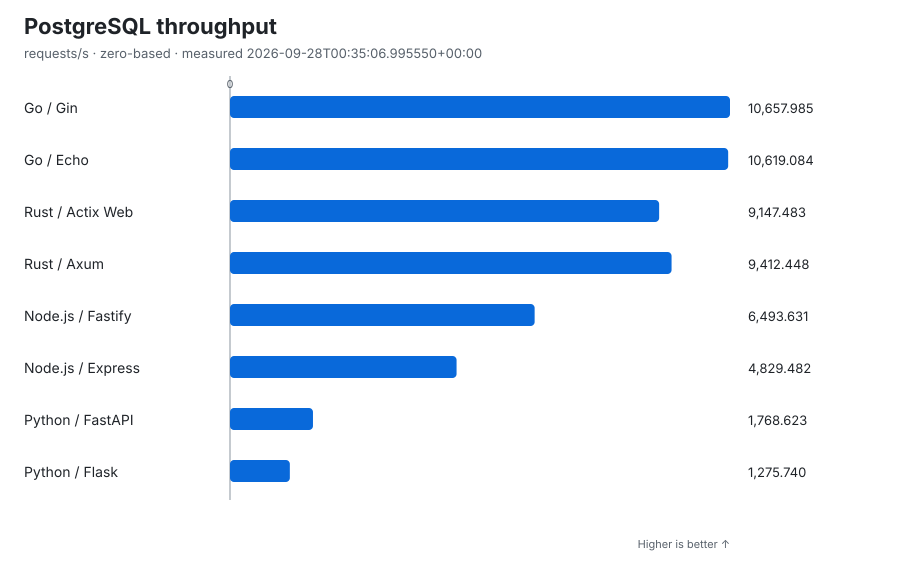
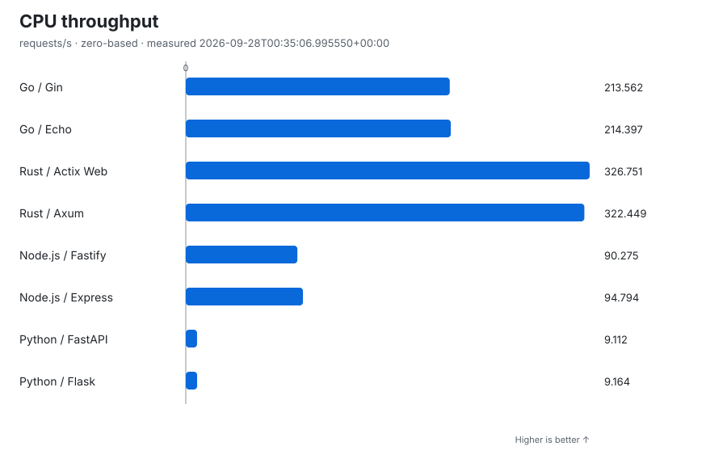

# Simple API Benchmark

[日本語](README.ja.md) · [Results site](https://tappe9.github.io/simple-api-benchmark/)

**Compare complete API stacks with the same API, resource caps and load profile.**

A small, reproducible comparison of Go, Rust, Node.js and Python stacks.
Start with the verified results below, or try one API locally.

Registration, CI coverage, official cohort membership and publication are separate.
The [registry and cohort guide](docs/IMPLEMENTATIONS.md#registered-and-measured-implementations)
is the current status reference. Java / Spring Boot is registered and CI-covered,
with official admission deferred in [Issue #73](https://github.com/tappe9/simple-api-benchmark/issues/73).
The [v0.1.0 release](docs/RELEASING.md) remains the original four-stack snapshot.

## Results

<!-- benchmark-results:start -->

Measured (UTC): `2026-09-28T00:35:06.995550+00:00`
Source: `c1d8e81b959e2c0ee0e5c4a1d8a7491790479f93` · [Actions run](https://github.com/tappe9/simple-api-benchmark/actions/runs/36360016510)
Cohort: `eight-stack-v1` · Definition: `simple-api-v1` · API readiness: `external-readiness`

1 CPU · 512 MiB · 1 worker · DB pool 10 · HTTP/1.1 · 50 connections · 5 s warm-up · 3 × 30 s per endpoint. Middle-throughput whole run selected.

### Throughput at a glance







<details>
<summary>Full selected-run values</summary>

| Backend | Test | Requests/s ↑ | Mean response ms ↓ | Observed peak MiB ↓ |
| --- | --- | ---: | ---: | ---: |
| Go / Gin | JSON | 23,100.118 | 2.162 | 13.650 |
| Go / Gin | PostgreSQL | 10,657.985 | 4.687 | 16.890 |
| Go / Gin | CPU | 213.562 | 233.207 | 15.480 |
| Go / Echo | JSON | 23,339.013 | 2.140 | 12.880 |
| Go / Echo | PostgreSQL | 10,619.084 | 4.705 | 15.950 |
| Go / Echo | CPU | 214.397 | 232.189 | 13.980 |
| Rust / Actix Web | JSON | 51,019.909 | 0.978 | 2.941 |
| Rust / Actix Web | PostgreSQL | 9,147.483 | 5.461 | 4.469 |
| Rust / Actix Web | CPU | 326.751 | 152.534 | 4.602 |
| Rust / Axum | JSON | 49,008.469 | 1.018 | 3.578 |
| Rust / Axum | PostgreSQL | 9,412.448 | 5.308 | 4.520 |
| Rust / Axum | CPU | 322.449 | 154.625 | 4.605 |
| Node.js / Fastify | JSON | 14,224.888 | 3.512 | 40.160 |
| Node.js / Fastify | PostgreSQL | 6,493.631 | 7.694 | 51.270 |
| Node.js / Fastify | CPU | 90.275 | 548.936 | 51.290 |
| Node.js / Express | JSON | 8,338.420 | 5.993 | 43.960 |
| Node.js / Express | PostgreSQL | 4,829.482 | 10.347 | 47.340 |
| Node.js / Express | CPU | 94.794 | 522.991 | 47.390 |
| Python / FastAPI | JSON | 3,161.497 | 15.808 | 40.610 |
| Python / FastAPI | PostgreSQL | 1,768.623 | 28.255 | 42.360 |
| Python / FastAPI | CPU | 9.112 | 5,074.272 | 42.250 |
| Python / Flask | JSON | 1,848.743 | 27.030 | 58.770 |
| Python / Flask | PostgreSQL | 1,275.740 | 39.160 | 59.360 |
| Python / Flask | CPU | 9.164 | 5,045.261 | 59.180 |

</details>

↑ Higher is better; ↓ lower is better. Every chart starts at zero and compares only throughput within one endpoint. Memory samples cover only the API container, not PostgreSQL, and can miss brief peaks. These are complete-stack reference results on shared GitHub-hosted hardware, not universal language rankings.

[Result JSON](results/latest.json) · [History](results/history/) · [Detailed results site](https://tappe9.github.io/simple-api-benchmark/) · [Methodology](docs/METHODOLOGY.md) · [Versions and conditions](results/latest.json)

<!-- benchmark-results:end -->

## What the results mean

Each stack serves the same [API contract](docs/API-CONTRACT.md):

| Endpoint | Work |
| --- | --- |
| `GET /json` | Return a small JSON response |
| `GET /db/42` | Read one PostgreSQL row and return JSON |
| `GET /cpu` | Calculate Fibonacci(30) by direct recursion |

`GET /health` is for readiness only. The [methodology](docs/METHODOLOGY.md)
describes the common resource caps, database fixture, pool limit and load settings.
One server process or worker does not imply identical request-thread models.
Contract checks precede measurement; request errors or timeouts prevent a valid publication.

These results compare the complete stack, including the runtime, HTTP server,
JSON library, database driver and container configuration. Shared GitHub-hosted
hardware and sampled API-container memory limit interpretation. A faster stack
in one run is not a universal language or framework ranking. Compare only the
members measured together under the displayed source and profile; never insert
new implementations into historical reports or interpret missing values as zero.

## Try one API locally

From a clone of this repository, open a terminal at its root. You need a running
Docker daemon, Docker Compose v2 with BuildKit and `up --wait` support, and curl.
No host Go, Rust, Node.js, Python or Java installation is needed for this example.
Leave port `8080` free and run one API at a time; the image build supplies its toolchain.

```bash
docker compose --project-name sab-example up --detach --build --wait go-gin
curl --fail http://127.0.0.1:8080/health
curl --fail http://127.0.0.1:8080/json
curl --fail http://127.0.0.1:8080/db/42
curl --fail http://127.0.0.1:8080/cpu
docker compose --project-name sab-example down --remove-orphans --volumes
```

This starts Go / Gin and its PostgreSQL dependency with the fixed test fixture.
Only the API's loopback port is published. The last command **deletes all
`sab-example` containers, its network, orphan containers and volumes**. PostgreSQL
uses tmpfs, so its local data is lost when the DB container stops. Use that project
only for this disposable example; run the same cleanup after an interrupted session.
These requests are a local demonstration, not a benchmark result.

## Go deeper

- [Local setup, implementation details and cleanup](docs/LOCAL-DEVELOPMENT.md)
- [Shared contract checks](CONTRIBUTING.md#shared-contract-checks) and [contributing](CONTRIBUTING.md)
- [Local benchmarks and result format](docs/BENCHMARK.md)
- [Requesting an official benchmark](docs/AUTOMATION.md#when-to-request-an-official-benchmark): explicit requests only; a dispatch includes audited publication and Pages deployment
- [Pages authorization and recovery](docs/AUTOMATION.md#github-pages): presentation recovery does not require remeasurement
- [Architecture](ARCHITECTURE.md) · [Roadmap](ROADMAP.md) · [Security](SECURITY.md)

## License

[MIT](LICENSE)
